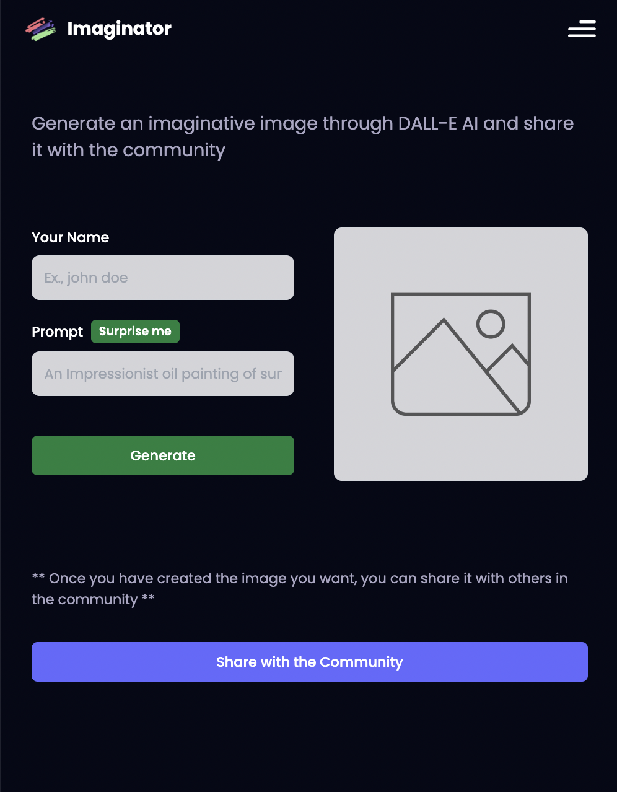

# Imaginator-AI-Image-Generator
Utilize the MERN (MongoDB, Express.js, React.js and Node.js) stack to develop this application. The website offers an innovative feature that generates images based on text input using OpenAI’s DALLE-E model. Users are empowered to create high-resolution photos measuring 1024x1024 pixels and easily share them within the community. These images are securely stored in Cloudinary and MongoDB. Additionally, users can conveniently browse through the community’s collection of photos and download them. To enhance the website’s visual appeal, implement the popular Tailwind CSS framework for styling purpose.  
#### Web Address: https://imaginator.website/
### Screenshot  
  
----

